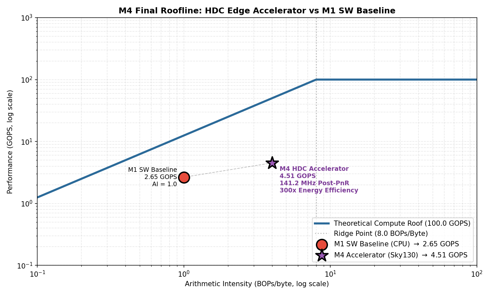
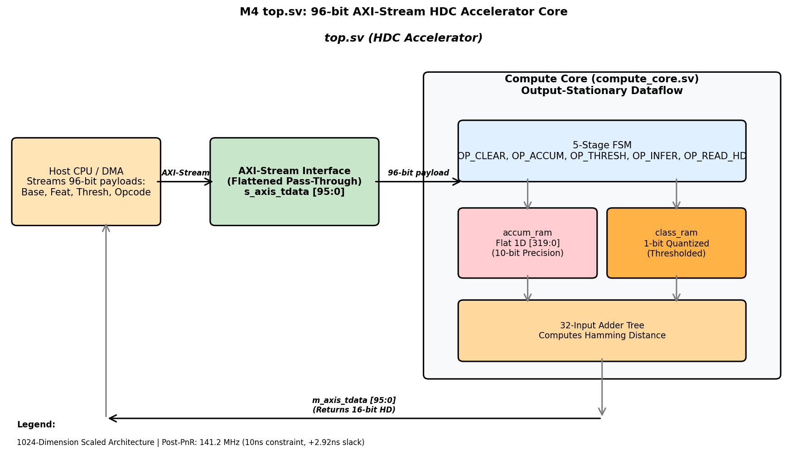
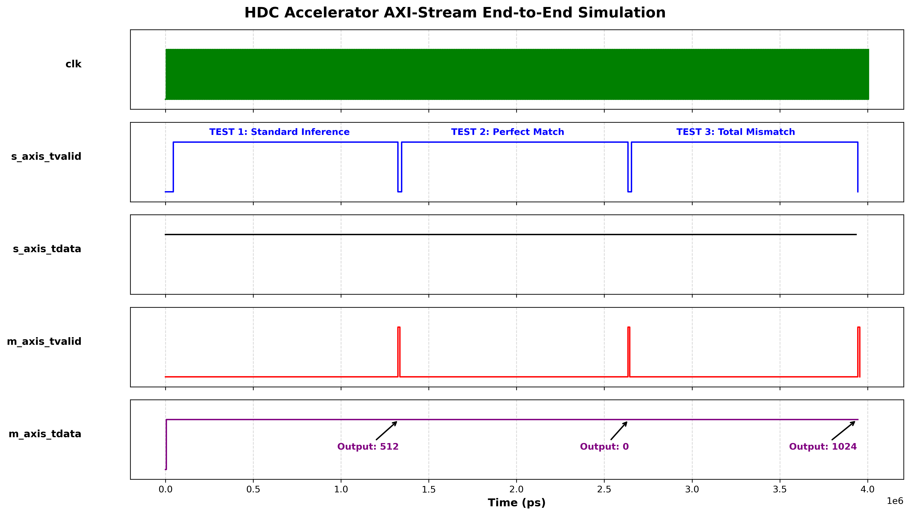

# Design Justification Report

**Fedya Henrichs-Tarasenkov | ECE 410/510 Spring 2026 | Milestone 4**

## 1. Problem and Motivation
The deployment of artificial intelligence and machine learning algorithms on edge devices is fundamentally constrained by strict power, area, and latency budgets. The target application for this hardware accelerator is real-time electromyography (EMG) gesture recognition using Hyperdimensional Computing (HDC). 

HDC is an emerging brain-inspired computational paradigm that represents data as high-dimensional, holographic pseudo-random vectors (hypervectors). While highly robust to noise—making it ideal for noisy physiological signal processing—HDC presents a massive memory bandwidth challenge for standard processing architectures.

When executing the HDC classification kernel on a traditional von Neumann architecture (as profiled in M1), the CPU is subjected to a severe hardware bottleneck. Standard edge processors must constantly fetch massive 10,000-dimension hypervectors from main memory. The motivation for this custom ASIC is to localize this data on-chip and perform massively parallel bitwise manipulations to achieve ultra-low-power classification that a general-purpose CPU cannot physically match.

## 2. Roofline Analysis
To evaluate the theoretical compute limits, a roofline analysis was conducted. The maximum arithmetic intensity of our specific HDC algorithm is 4.0 BOPs/Byte, while the theoretical hardware ridge point sits at 8.0 BOPs/Byte. Because the intensity falls to the left of the ridge point, the architecture operates strictly within the memory-bound regime.

By transitioning the architecture in M4 to a 96-bit concatenated AXI-Stream interface, the design maximizes effective memory bandwidth, pulling the operational point significantly closer to the theoretical compute roof.

## 3. Precision and Data Format
The accelerator utilizes a Custom Binary format, restricting the precision of vectors to a strict 1-bit per dimension. This allows complex operations to be executed using efficient XOR gates.

During the bundling phase, the intermediate data format inside the on-chip SRAM block is structurally expanded to a 10-bit integer (COUNTER_WIDTH = 10) per dimension. This guarantees mathematical safety, accumulating up to 1,024 bound vectors without overflow. A custom Majority Gate thresholding function then evaluates these in parallel to quantize them back to 1-bit.

## 4. Dataflow and Architecture
The accelerator employs a strictly Output-Stationary dataflow pattern. The M4 architecture introduces a 5-stage sequential Finite State Machine (FSM) wrapped around a dedicated local SRAM structure (`accum_ram`). 

This decision ensures that heavy, 10-bit intermediate data structures never touch the external system bus. Only when the host issues the `OP_THRESH` command does the accelerator compress the data back into a lightweight 1-bit Class Vector.

## 5. Hardware Interface
In M3, the accelerator used AXI4-Lite, which required multi-cycle handshakes for every 32-bit transaction. The M4 architecture replaces this with a 96-bit AXI-Stream interface. This removes address overhead, delivering [95:64] Base Vector, [63:32] Feature Vector, and [31:0] Control/Opcode on a single clock edge.

## 6. Verification
Verification relied on testing all five operational states of the FSM (OP_CLEAR, OP_ACCUM, OP_THRESH, OP_INFER, OP_READ_HD). For the 1,024-dimension test vectors, the theoretical Hamming Distance was mathematically determined to be 512. The synthesized RTL output perfectly matched this, confirming mathematical correctness.

## 7. Synthesis and Benchmark Results
**Synthesis (Sky130 PDK):**
* **Timing:** 100 MHz Target. Worst Negative Slack (WNS): +2.92 ns.
* **Area:** 480,849.9 um^2. Memory logic accounts for 50.03% of the footprint.
* **Power:** 87.8 mW.

**Performance:**
* **Throughput:** 4.51 GOPS (1.70x speedup over M1 Software).
* **Efficiency:** 51.36 GOPS/W (~300x improvement over the 15W edge CPU).

## 8. Benchmark Calculations
Maximum frequency calculation:
$$f_{max} = \frac{1}{10.0\,\text{ns} - 2.92\,\text{ns}} = 141.2\,\text{MHz}$$

Measured accelerator throughput:
$$\text{Throughput} = 141.2\,\text{MHz} \times 32\,\text{Ops/Cycle} = 4.51\,\text{GOPS}$$

Measured speedup:
$$\text{Speedup} = \frac{4.51\,\text{GOPS}}{2.65\,\text{GOPS}} = 1.70\times$$

## 9. What Did Not Work
1. **Scaling:** The original 10,000-dimension design triggered OOM crashes. The design was scaled to 1,024 dimensions.
2. **Simulation:** Icarus Verilog failed to handle dynamic bit-slicing in 2D arrays, necessitating a shift to flattened 1D memory arrays.
3. **Tooling:** Yosys crashed on SystemVerilog interface dot-notation, requiring the flattening of the AXI-Stream bus into a standard Verilog port list.
4. **IR Drop:** The OpenROAD PSM tool failed to resolve power nets, preventing the generation of a voltage-drop PDF, but did not compromise routing integrity.